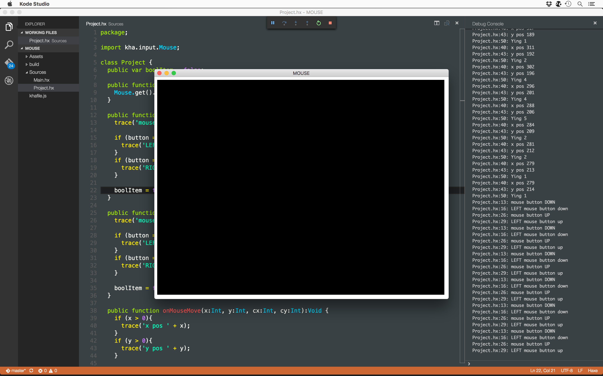

# kha examples
these are some kha examples, to help get new users [plus other users] to get to grips with the super awesome [kha](https://github.com/KTXSoftware/Kha)

its highly recommended to run these projects in the super, uber, duper sexy [kode studio](https://github.com/KTXSoftware/KodeStudio/releases)

follow this super useful post on getting up & running with it - [kode studio forum post](http://kode.tech/kode-studio-16-1/)

also, if you want the super duper awesome theme from the screenshot, grab 'lestle-vscode' from my [lestle theme collection](https://github.com/lewislepton/lestle-theme-collection) & put it in your extension folder.

#KHA2D

for kha2d based fun. you *will* need to install [kha2d](https://github.com/KTXSoftware/Kha2D) into haxelib. go to terminal & input this

`haxelib install git kha2d https://github.com/KTXSoftware/Kha2D.git`

for mac users, you will need to put sudo before like this:

`sudo haxelib install git kha2d https://github.com/KTXSoftware/Kha2D.git`

then check the `khafile.js` within the projects folder to see how its imported. its super simple with [kode studio](https://github.com/KTXSoftware/KodeStudio/releases).
simply import by going to `khafile.js` & adding a library:

`project.addLibrary('kha2d');`

------

have phün & happy coding

[lewis lepton](http://lewislepton.com)